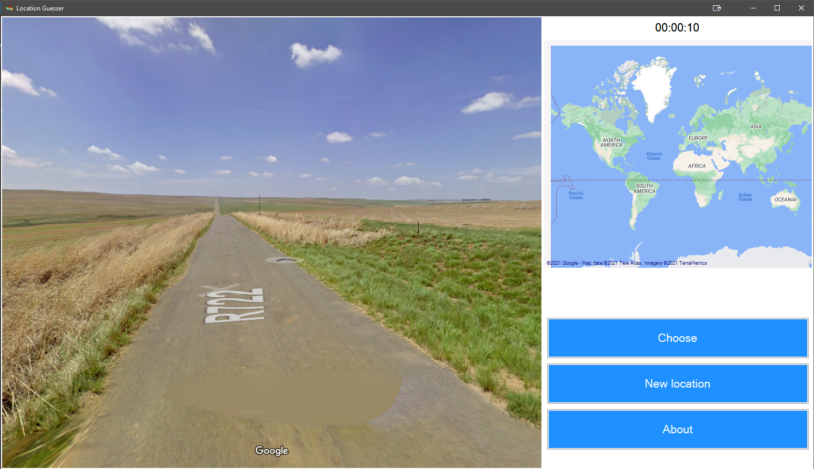
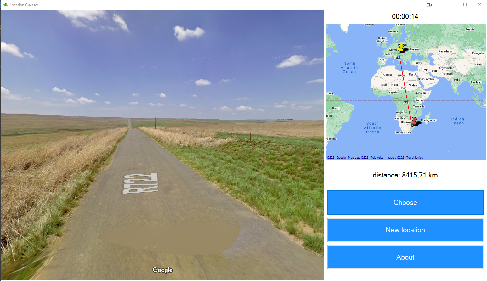
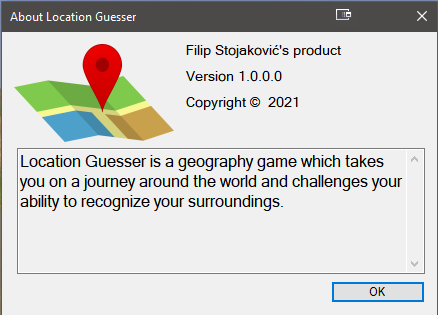

# Location Guesser
### Short description 
Location Guesser is a geography game which takes you on a journey aroind the world and challenges your ability to recognize your surroundings.

### Long description
The game uses a semi-randomized Google Street View location. 
The game requires players to guess their location in the world using only the clues visible.
The locations are limited to roads and other paths that have been photographed by Google Street View cameras for paying members.
The player may move along the roads through the normal directional controls provided by Street View. 
Once the player is ready to guess the location, they will place a location marker on a zoomable map.
After the placed marker is submitted as a guess, the game reveals the true geographic location and distance depending on how far away the player's guess was from the true location.

When guessed location is submited and the true location is reveald, the player can no longer move or click on the map. In that case player can start over, new random location is then provided to the player, and the process repeats.

### In-Game images

